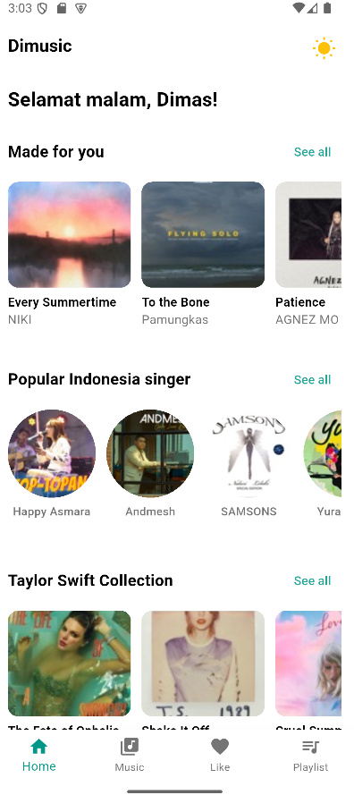
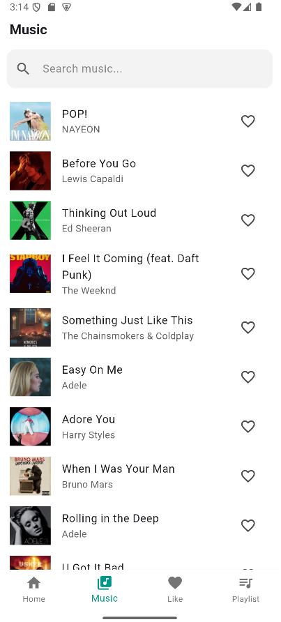
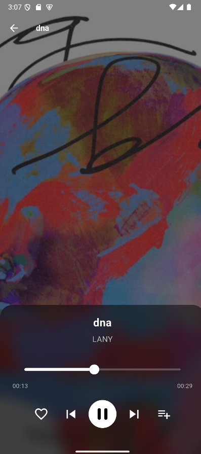
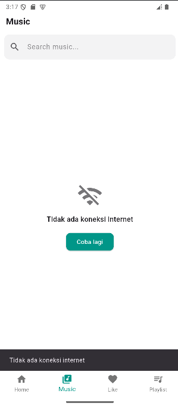

# DIMUSIC (UAS Mobile Programming)

Aplikasi pemutar musik sederhana berbasis Flutter yang memungkinkan pengguna mencari lagu, memutar preview audio, menyimpan playlist, dan menandai lagu favorit.

## 🖼️ *App Preview*

| Home Page  | Music Search | Music Player Page | Error Handling |
|:------------------:|:-----------:|:-----------:|:------------------:|
|  |  |  |  |

---


**Fitur utama**
- Cari lagu menggunakan iTunes Search API.
- Memutar preview audio dari hasil pencarian.
- Menyimpan playlist lokal dan menandai lagu sebagai favorit.

**Struktur singkat**
- Kode utama berada di folder `lib/`.
- Service untuk pencarian lagu: `lib/services/itunes_api.dart`.
- Model data lagu: `lib/models/song_model.dart`.
- Halaman UI berada di `lib/pages/` dan widget di `lib/widget/`.

**Daftar Endpoint API yang digunakan**
- iTunes Search API (untuk mencari lagu):
	- Method: `GET`
	- Endpoint: `https://itunes.apple.com/search`
	- Parameter penting: `term` (kata kunci pencarian), `entity=song` (mengambil entitas lagu)
	- Contoh request:
		- `https://itunes.apple.com/search?term=adele&entity=song`
	- Response: JSON; hasil utama berada di field `results` berisi array objek lagu (diproses oleh `Song.fromJson`).

Catatan: Implementasi pada proyek ini berada di `lib/services/itunes_api.dart` yang melakukan request ke URL di atas dan mengubah respons menjadi daftar `Song`.

**Cara Instalasi & Menjalankan (Windows)**
Prasyarat:
- Install Flutter SDK dan tambahkan ke `PATH`. Ikuti panduan resmi di https://docs.flutter.dev/get-started/install/windows
- Install Android Studio (atau gunakan perangkat/emulator Android lain) dan buat emulator/aktifkan opsi developer pada perangkat fisik.
- Pastikan `flutter` tersedia di terminal PowerShell.

Langkah menjalankan proyek:
1. Buka terminal di root proyek (folder yang berisi `pubspec.yaml`).
2. Ambil dependensi:

```
flutter pub get
```

3. Menjalankan aplikasi pada emulator atau perangkat terhubung:

```
flutter run
```

4. (Opsional) Membangun APK release:

```
flutter build apk --release
```

Tips debug:
- Jalankan `flutter doctor` untuk memeriksa environment dan komponen yang hilang.
- Jika ada masalah koneksi ke iTunes API, periksa koneksi internet dan izin jaringan pada emulator/perangkat.

**Kontribusi & Lisensi**
- Proyek ini dibuat sebagai tugas UAS mata kuliah Mobile Programming. 

